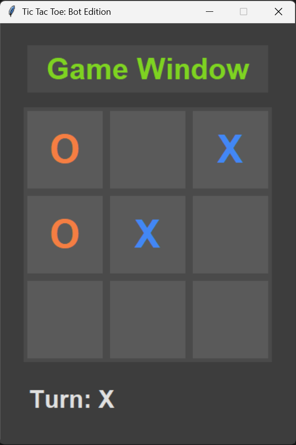
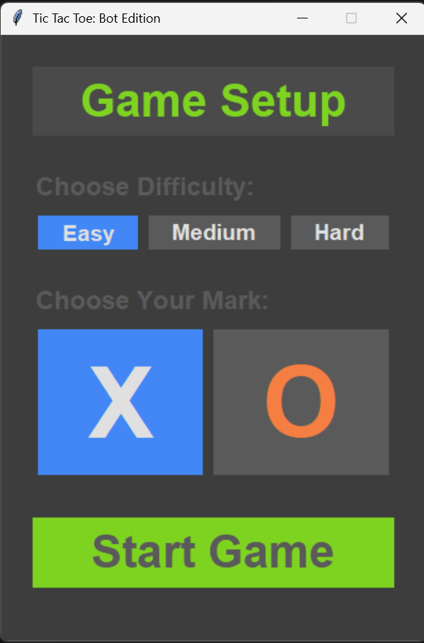
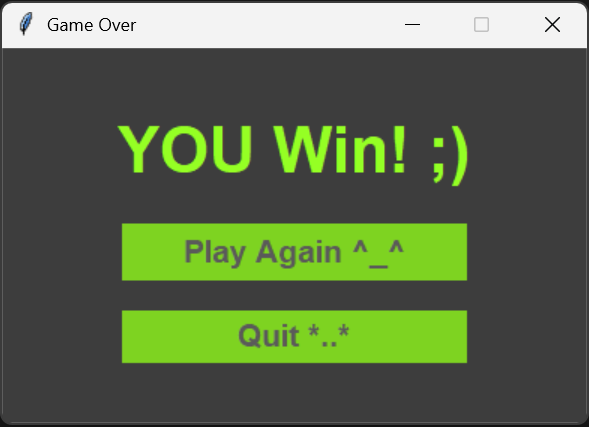

<div align="center">

# 🎮 Tic-Tac-Toe Bot Edition 🤖

**A modern, GUI-based Tic-Tac-Toe game where you can challenge an AI opponent with varying levels of difficulty, including an unbeatable AI powered by the Minimax algorithm.**

</div>

<div align="center">
</div>

---

<div align="center">



</div>

## ✨ Key Features

-   **🤖 Smart AI Opponent:** Test your skills against an automated opponent.
-   **📈 Multiple Difficulty Levels:**
    -   **Easy:** The bot picks moves randomly.
    -   **Medium:** The bot will block your winning moves and seize its own.
    -   **Hard:** The bot uses the **Minimax algorithm** to play a perfect game, making it impossible to defeat.
-   **🎨 Interactive GUI:** A clean and user-friendly interface built from scratch with Python's Tkinter library.
-   **⚙️ Game Setup:** Choose your difficulty and whether you want to play as 'X' or 'O' before each match.
-   **📦 Standalone Executable:** Comes with a pre-compiled `.exe` file for Windows, allowing anyone to play without needing Python installed.

---

## 📸 Screenshots

<div align="center">

| Setup Screen                                                                                    | Game Over Screen                                                                                |
| ----------------------------------------------------------------------------------------------- | ----------------------------------------------------------------------------------------------- |
| <br> |                                                   <br> |

</div>

---

## 🚀 How to Play

### 1. Using the Executable (Recommended for Players)

1.  Navigate to the root directory of this project.
2.  Find and double-click the **`Tic-Tac-Toe Bot Edition.exe`** file to run the game. No installation is required!

### 2. Running from Source Code (For Developers)

If you want to run or modify the source code, follow these steps:

1.  **Clone the repository:**
    ```sh
    git clone https://github.com/adios-07/Tic-Tac-Toe-Final-Boss.git
    cd Tic-Tac-Toe-Final-Boss
    ```

2.  **Ensure you have Python installed** (version 3.x is recommended). Tkinter is included in the standard library.

3.  **Run the main file:**
    ```sh
    python Main.py
    ```

---

## 🛠️ Built With

-   **[Python](https://www.python.org/)** - The core programming language.
-   **[Tkinter](https://docs.python.org/3/library/tkinter.html)** - The GUI framework used.
-   **[PyInstaller](https://www.pyinstaller.org/)** - Used to create the standalone executable.

